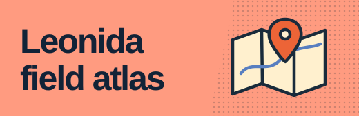

<h1><picture>
  <source media="(max-width: 600px)" srcset="./assets/folio/field-mobile.svg">
  
</picture></h1>

I build AI tools and business applications in **Python, TypeScript, C# and .NET**. In procurement, that means helping a reviewer trace a recommendation back to vendor evidence. In developer tools, it means helping one coding agent pick up a decision where another left off.

**Open to software engineering and applied AI roles, and to research collaborations.** [Connect on LinkedIn](https://www.linkedin.com/in/ihtishamdeveloper/) · [Email me](mailto:Theihtisham@outlook.com)

## Selected work

**[ProcureGuard AI](https://github.com/theihtishaam/Procure-guard-ai) · Procurement.** Eight specialist agents review a vendor submission before a person signs off. My team, Purrwolf, won **Best Use of AI/ML API** at the Band of Agents Hackathon. [Demo](https://youtu.be/KhKxOJJEYho) · [Award announcement](https://www.linkedin.com/posts/lablab-ai_meet-the-ai-that-can-veto-its-own-approval-activity-7487495363164233728-iQSx)

**[Agent Shadow Brain](https://github.com/theihtishaam/agents-brain) · Developer tools.** Follow a decision from one coding tool to the next and inspect the handoff in Brain Hub. [Watch a recorded handoff](https://raw.githubusercontent.com/theihtishaam/agents-brain/v7.25.0/docs/assets/7.25.0-agent-traffic.gif)

**[CivicTwin Δ](https://github.com/theihtishaam/CiviTwin) · Decision support.** Change a tax assumption and follow the rules and evidence behind the result. [Read the case study](./docs/projects/civic-twin.md)

**Research interests** · How can a coding agent carry a decision between tools without losing its context? How can a reviewer trace an AI recommendation back to the evidence?

[All repositories](#public-repositories) · [npm downloads](#npm-downloads) · [Technical skills](#languages--tools) · [Contact](#contact)

## npm downloads

<!-- AUTO_NPM_PACKAGES_START -->
**GTA 6 Loot Map**

Compare packages over 30 days

<!-- AUTO_NPM_PACKAGES_END -->

The GTA counter refreshes daily. [Download records and reporting dates](./data/npm-packages.json)

**Inside Omni Skills Forge**

<!-- AUTO_OMNI_CATALOG_START -->
**50,009 skill files · 28 categories.** [Catalog counts](https://github.com/theihtishaam/omni-skills-forge/blob/main/docs/catalog-stats.json).
<!-- AUTO_OMNI_CATALOG_END -->

## Public repositories

<!-- AUTO_PUBLIC_PROJECTS_START -->
<table>
<tr>
<td width="50%" valign="top">

<h3><a href="https://github.com/theihtishaam/agents-brain">Agent Shadow Brain</a></h3>

Save a decision or a handoff in one coding tool and pick it up in another. The Brain Hub shows recorded exchanges in the workspace.

TypeScript · <a href="https://raw.githubusercontent.com/theihtishaam/agents-brain/v7.25.0/docs/assets/7.25.0-agent-traffic.gif">Watch the Brain Hub recording</a>

</td>
<td width="50%" valign="top">

<h3><a href="https://github.com/theihtishaam/Procure-guard-ai">ProcureGuard AI</a></h3>

Eight specialist agents check vendor evidence before human signoff. Team Purrwolf won Best Use of AI/ML API at the 2026 Band of Agents Hackathon.

Python · <a href="https://youtu.be/KhKxOJJEYho">Watch the demo</a> · <a href="https://www.linkedin.com/posts/lablab-ai_meet-the-ai-that-can-veto-its-own-approval-activity-7487495363164233728-iQSx">Award announcement</a>

</td>
</tr>
<tr>
<td width="50%" valign="top">

<h3><a href="https://github.com/theihtishaam/exactwork-skills">ExactWork Skills</a> · ★ 2</h3>

Six portable skills for execution, research, review, handoff, context, and learning. Choose the instructions a project needs.

Python · <a href="./docs/projects/exactwork-skills.md">Explore the six skills</a>

</td>
<td width="50%" valign="top">

<h3><a href="https://github.com/theihtishaam/GTA-6-Interactive-Map-and-Loot-Tracker">GTA 6 Loot Map</a></h3>

Choose a mission or collectible, plot a route across Leonida, and keep an offline field journal.

Python · <a href="https://raw.githubusercontent.com/theihtishaam/GTA-6-Interactive-Map-and-Loot-Tracker/v0.1.3/docs/quickstart/reward-map.webp">See the atlas</a> · <a href="https://github.com/theihtishaam/GTA-6-Interactive-Map-and-Loot-Tracker#readme">Player guide</a>

</td>
</tr>
<tr>
<td width="50%" valign="top">

<h3><a href="https://github.com/theihtishaam/omni-skills-forge">Omni Skills Forge</a></h3>

Find relevant guidance in a workspace, switch skills on or off, and combine a few files into one project skill.

JavaScript · <a href="https://github.com/theihtishaam/omni-skills-forge#open-it-in-your-project">Dashboard walkthrough</a>

</td>
<td width="50%" valign="top">

<h3><a href="https://github.com/theihtishaam/CiviTwin">CivicTwin Δ</a></h3>

Change an assumption in a tax scenario, then trace the rules, evidence, and results in this enterprise planning prototype.

TypeScript · <a href="./docs/projects/civic-twin.md">Read the case study</a>

</td>
</tr>
<tr>
<td colspan="2" valign="top">

<h3><a href="https://github.com/theihtishaam/theihtishaam">GitHub Profile</a></h3>

The artwork, repository index, and public-data tools behind this profile.

JavaScript

</td>
</tr>
</table>

7 public repositories · Updated 2026-11-22 · [Browse on GitHub](https://github.com/theihtishaam?tab=repositories) · [Project directory](./docs/PUBLIC_PROJECTS.md)
<!-- AUTO_PUBLIC_PROJECTS_END -->

## Languages & tools

| Area | Tools I use |
| --- | --- |
| Business applications | C#, .NET, ASP.NET MVC, WPF, SQL Server, IIS |
| Web interfaces and APIs | TypeScript, JavaScript, Angular, React, HTML, CSS, REST |
| Data and analysis | Python, Flask, Pandas, NumPy, PostgreSQL, MySQL |
| Agent tooling and delivery | Node.js, MCP, Git, GitHub Actions, Azure, AWS |

## Websites

- [**Ababil Technology**](https://ababiltechnology.com/) builds business software and provides technology services.

## Repository activity

<!-- AUTO_LATEST_REPOSITORIES_START -->

<a title="Created 2026-11-21 · Choose a mission or collectible, plot a route across Leonida, and keep an offline field journal." href="https://github.com/theihtishaam/GTA-6-Interactive-Map-and-Loot-Tracker">GTA 6 Loot Map</a> · <a title="Created 2026-11-13 · Find relevant guidance in a workspace, switch skills on or off, and combine a few files into one project skill." href="https://github.com/theihtishaam/omni-skills-forge">Omni Skills Forge</a> · <a title="Created 2026-11-13 · Change an assumption in a tax scenario, then trace the rules, evidence, and results in this enterprise planning prototype." href="https://github.com/theihtishaam/CiviTwin">CivicTwin Δ</a>
<!-- AUTO_LATEST_REPOSITORIES_END -->

<!-- AUTO_RECEIVED_STARS_START -->

<b>★ 2 total stars</b> &nbsp; <a href="https://github.com/theihtishaam/exactwork-skills">exactwork-skills</a> · ★ 2

<!-- AUTO_RECEIVED_STARS_END -->

## Contact

  
  
  
  
  
  

